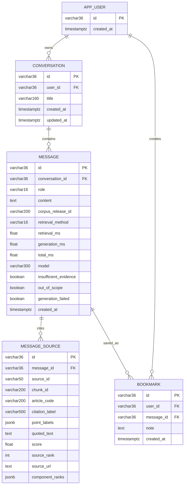

# ERD dữ liệu hội thoại và bookmark

## Giải thích khi trình bày

ERD trên mô tả dữ liệu nghiệp vụ được lưu trong PostgreSQL. `APP_USER` hiện là
người dùng ẩn danh được nhận diện bằng UUID của trình duyệt. Một người dùng có
nhiều hội thoại; một hội thoại có nhiều message; một message assistant có thể có
nhiều snapshot nguồn và được đánh dấu tối đa một lần cho mỗi người dùng.

`MESSAGE_SOURCE` lưu snapshot nguồn đúng tại thời điểm câu trả lời được tạo. Vì
vậy lịch sử vẫn hiển thị đúng căn cứ đã dùng ngay cả khi Qdrant được rebuild hoặc
corpus mới được phát hành sau này.

Corpus JSON/JSONL và Qdrant không được biểu diễn thành bảng trong ERD này:

- JSON/JSONL là release canonical bất biến, không phải dữ liệu quan hệ phát sinh;
- Qdrant là vector database và được thể hiện trong sơ đồ kiến trúc, không phải ERD
  quan hệ;
- `document_id`, `article_code` và `chunk_id` trong `MESSAGE_SOURCE` là khóa tham
  chiếu logic sang corpus tại `corpus_release_id` đã ghi trên message.

Khi bổ sung đăng nhập, `APP_USER` có thể mở rộng với email, password hash hoặc
liên kết OAuth mà không phải thay đổi quan hệ Conversation–Message–Bookmark.
