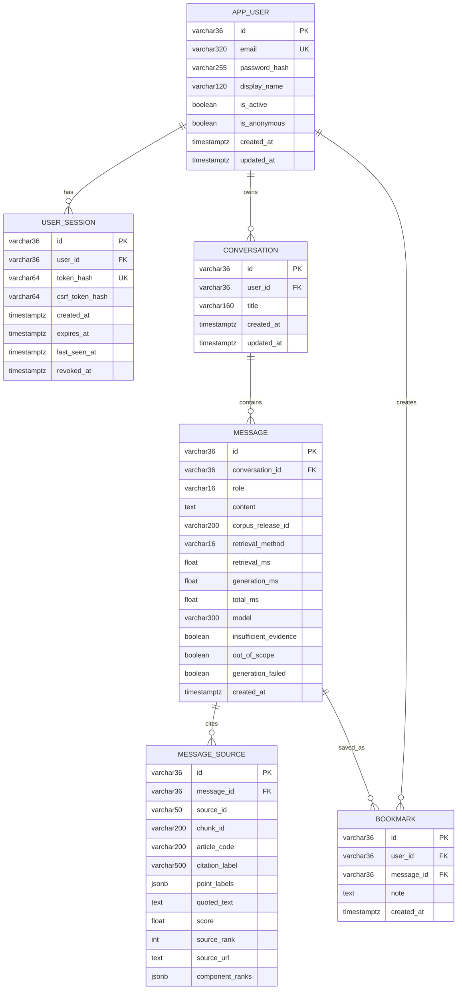

# ERD tài khoản, session, hội thoại và bookmark

## Giải thích khi trình bày

`APP_USER` là tài khoản nghiệp vụ. Email được chuẩn hóa và đặt unique; mật khẩu
chỉ lưu dưới dạng PBKDF2 hash. Các dòng ẩn danh cũ được giữ tạm với
`is_anonymous=true` để có thể chuyển lịch sử vào tài khoản khi người dùng đăng
ký hoặc đăng nhập lần đầu.

`USER_SESSION` lưu phiên đăng nhập phía server. Trình duyệt chỉ giữ session token
ngẫu nhiên trong cookie `HttpOnly`; PostgreSQL chỉ giữ SHA-256 hash của token.
Một tài khoản có thể có nhiều session tương ứng nhiều trình duyệt hoặc thiết bị.
Logout đặt `revoked_at`, nên session bị thu hồi ngay.

Một tài khoản có nhiều hội thoại; một hội thoại có nhiều message. Message
assistant có thể có nhiều snapshot nguồn và chỉ có tối đa một bookmark cho mỗi
người dùng nhờ unique constraint `(user_id, message_id)`.

`MESSAGE_SOURCE` lưu snapshot căn cứ đúng tại thời điểm câu trả lời được tạo. Vì
vậy lịch sử vẫn hiển thị căn cứ đã dùng ngay cả khi Qdrant được rebuild hoặc có
corpus release mới.

Corpus JSON/JSONL và Qdrant không được biến thành bảng trong ERD này:

- JSON/JSONL là release canonical bất biến;
- Qdrant là vector database và thuộc sơ đồ kiến trúc hệ thống;
- `article_code`, `chunk_id` và `corpus_release_id` là liên kết logic từ snapshot
  nguồn về corpus đã dùng.
